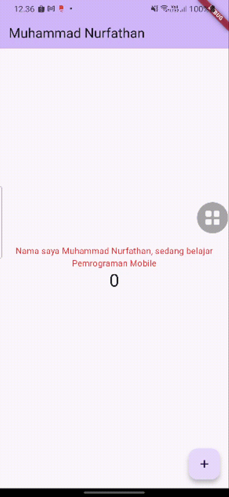

# Hello World - Praktikum Flutter 🚀  
**Nama:** Muhammad Nurfathan Athaillah Humaedi  
**NIM:** 230444040010  

Selamat datang di repositori ini! 🎉 Ini adalah kumpulan hasil dari praktikum Flutter yang saya kerjakan. Setiap praktikum berisi eksperimen menarik seputar pengembangan aplikasi mobile dengan Flutter.  

---

## 📌 Praktikum 1: Dasar Flutter  
### Screenshots 📸  
  
  
  
  
  
  
  
  
  

---

## 🎬 Praktikum 2
### Demo (GIF) 🎥  
  
  
  
  
  
  
  
  
  

---

## 🎨 Praktikum 3: Layout & Styling  
Eksperimen dengan layout responsif dan tampilan yang menarik.  
### Screenshots 📸  
  
  

---

## 🛠 Praktikum 4: State Management  
### SCreenshots 📸  
  
  

---

## 📲 Praktikum 5
### Screenshots 📸  
  
  
  
  
  
  

## Getting Started

This project is a starting point for a Flutter application.

A few resources to get you started if this is your first Flutter project:

- [Lab: Write your first Flutter app](https://docs.flutter.dev/get-started/codelab)
- [Cookbook: Useful Flutter samples](https://docs.flutter.dev/cookbook)

For help getting started with Flutter development, view the
[online documentation](https://docs.flutter.dev/), which offers tutorials,
samples, guidance on mobile development, and a full API reference.
